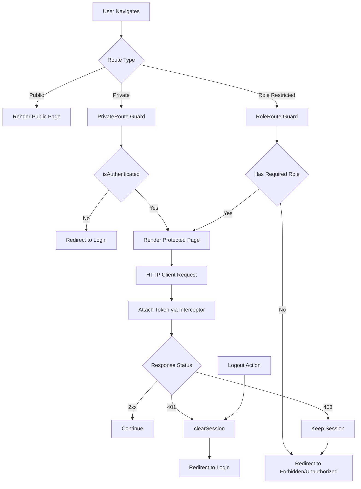

# Auth Session Architecture

Use this reference when the task requires end-to-end auth/session flow reasoning across routing, context, and API behavior.

## Mermaid Diagram

## Boundary Notes
- Route guards own access entry decisions.
- Auth service owns token/session read-write and session clearing.
- HTTP client middleware owns token attachment and centralized `401/403` handling.
- Feature/page components consume `useAuth`; they do not own session persistence.
