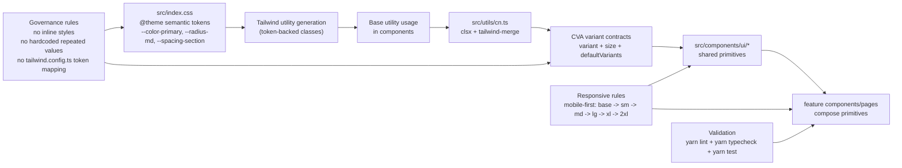

# Architecture

This architecture describes the React + Tailwind styling system itself: how semantic tokens flow into utilities, how class composition is standardized, and how reusable variants propagate into UI primitives and feature components.

## Tailwind Styling System Architecture

## Layer Responsibilities

- `src/index.css`: single source of truth for semantic design tokens.
- Tailwind utilities: consume tokens for consistent style primitives.
- `src/utils/cn.ts`: deterministic class merge behavior for conditional styling.
- CVA variants: reusable state/size/tone contracts with `defaultVariants`.
- `src/components/ui/*`: shared building blocks that enforce styling contracts.
- Feature components/pages: compose primitives without redefining core variant logic.

## Output Contract

A correct implementation should show:
- token-first styling updates in `src/index.css`,
- CVA-driven reusable variant APIs,
- consistent `cn()` class composition,
- mobile-first responsive behavior across UI layers.
