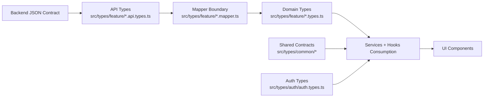

# Architecture

## Type Boundary Flow

## Layer Responsibilities
- API types mirror transport payloads exactly.
- Mappers translate transport shape into domain/UI shape.
- Domain types model what frontend features consume.
- Shared contracts hold cross-feature primitives (error, pagination, envelopes).
- Auth type file location is standardized under `src/types/auth/`.

## Ownership Boundaries
- Query orchestration and hook design are delegated to `api-integration-data-layer`.
- Error boundary rendering is delegated to `error-boundaries`.
- Logging, Sentry, and query client wiring are delegated to `logging-monitoring`.
