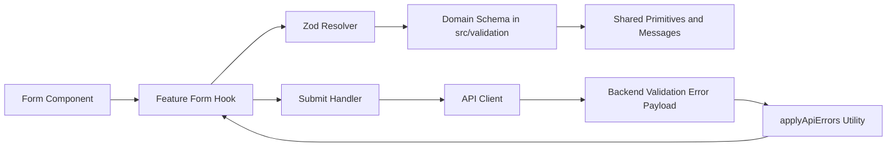

# Architecture

## Validation flow architecture

## Layer boundaries
- UI components render fields and messages only.
- Feature form hooks own RHF wiring and submit orchestration.
- Validation schemas own all runtime field and cross-field constraints.
- Shared primitives/messages provide reuse across domains.
- Error mapping utility bridges backend errors into RHF field state.

## Out-of-scope boundaries
- Data fetching hooks and cache ownership stay in `api-integration-data-layer`.
- Query client and telemetry setup stay in `logging-monitoring` (toast behavior in `ui-states`).
- Error boundary components stay in `error-boundaries`.
- Auth context state container stays in `react-state-management`.
- Route folder naming policy stays in `routing-navigation`.
